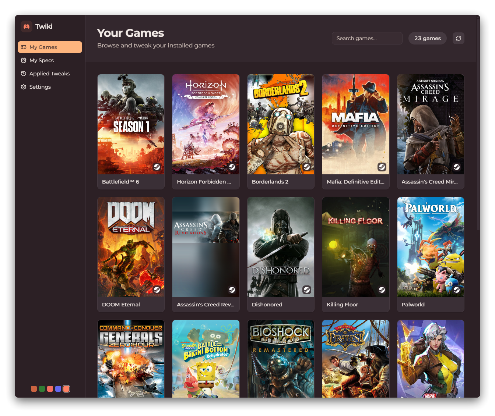
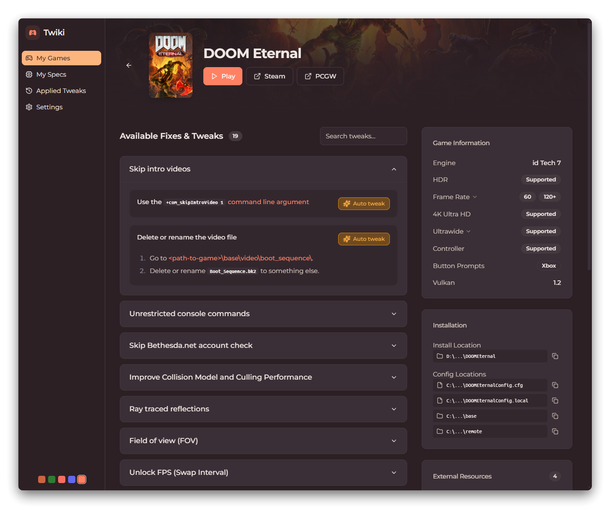
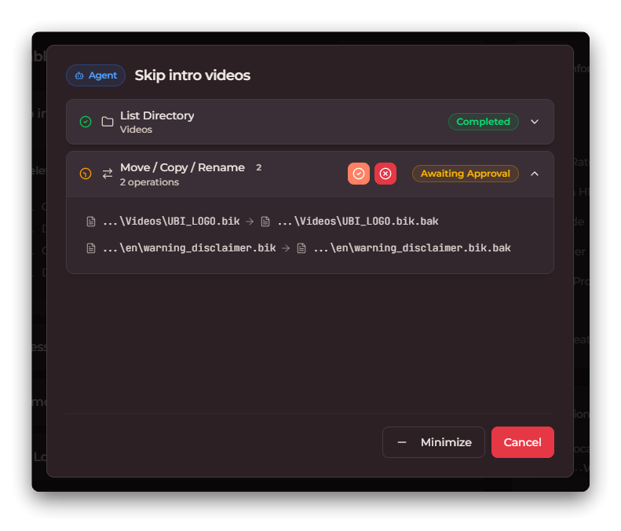
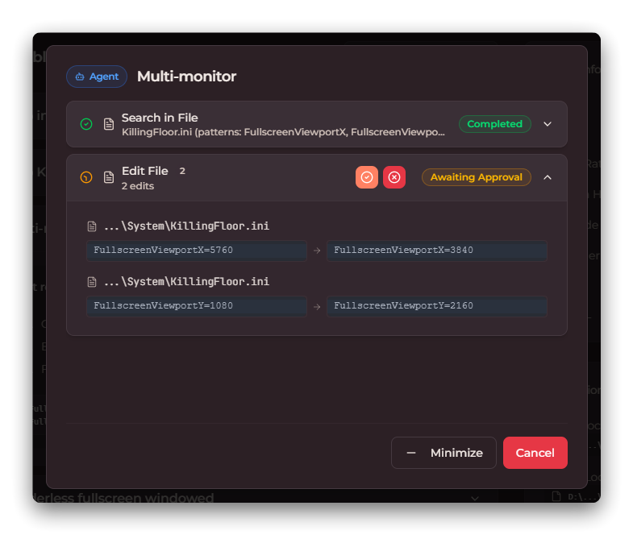



  
  <h2 align="center">Twiki - PCGamingWiki Client + Tweak Automation</h2>
  

    Twiki is a <a href="https://www.pcgamingwiki.com/">PCGamingWiki</a> client for browsing and applying game tweaks. 
    You can apply tweaks manually using the built-in tools, or let the Auto Tweaker (an AI agent) handle config edits, registry changes, and file operations for you.
  

<!-- 

  
  &nbsp;&nbsp;
  

 -->

  

## How It Works

1. Open Twiki - it detects your installed games
2. Pick a game to see available tweaks from PCGamingWiki
3. Apply tweaks manually, or hit "Auto Tweak" and let the Auto Tweaker handle it

The game page shows install paths and config file paths - all clickable to open in file explorer or the built-in text editor. Some tweaks are out of scope for automation, so you just follow the instructions like you would on the PCGamingWiki website.

## Auto Tweaker

The Auto Tweaker is an AI agent that reads the tweak instructions and figures out what operations to perform - editing config files, creating / moving files, modifying registry entries, downloading patches, etc.

  
  &nbsp;&nbsp;
  

**What it sends to the agent:**
- Game info (name, install path, config file paths, executable paths)
- Tweak instructions from PCGamingWiki
- System specs (OS, CPU, GPU, display resolution - optional, you can toggle which are shared in settings)

**What control you have:**
- You review every operation before it runs - nothing happens without your approval
- All changes are backed up automatically, so you can revert any tweak
- System specs sharing is optional and configurable

**What it can do:**
- Edit config files
- Modify Windows Registry entries
- Download and extract patches
- Move, copy, and create files
- Extract and repack game archives
- Set launch options
- Set CPU affinity and file attributes
- Install ReShade addons (e.g. RenoDX HDR Mods)

**What it can't do (yet):**
- In-game menu settings (anything that requires launching the game)
- GPU driver settings (NVIDIA Control Panel, AMD Software, etc.)
- Running installers or configuration wizards
- Website actions (account registration, activation, etc.)

No personal data is collected or stored.

## Installation

Windows only for now. Download the latest release from the [releases page](https://github.com/elisoftli/twiki/releases/latest).

## Supported Launchers

| Launcher | Status |
|----------|--------|
| Steam | ✅ |
| Xbox | ⏳ |
| Epic Games | ⏳ |
| Ubisoft Connect | ⏳ |
| GOG Galaxy | ⏳ |
| EA App | ⏳ |

## Issues & Feedback

If you run into problems or have ideas, open an issue and I'll gladly take a look 🙂.

## Notes

- All tweak data comes from [PCGamingWiki](https://www.pcgamingwiki.com/) - an amazing community-driven resource

- This is an unofficial project, not affiliated with PCGamingWiki
